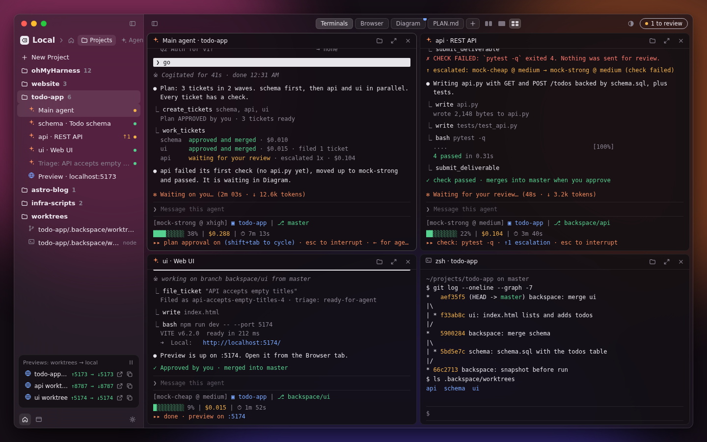
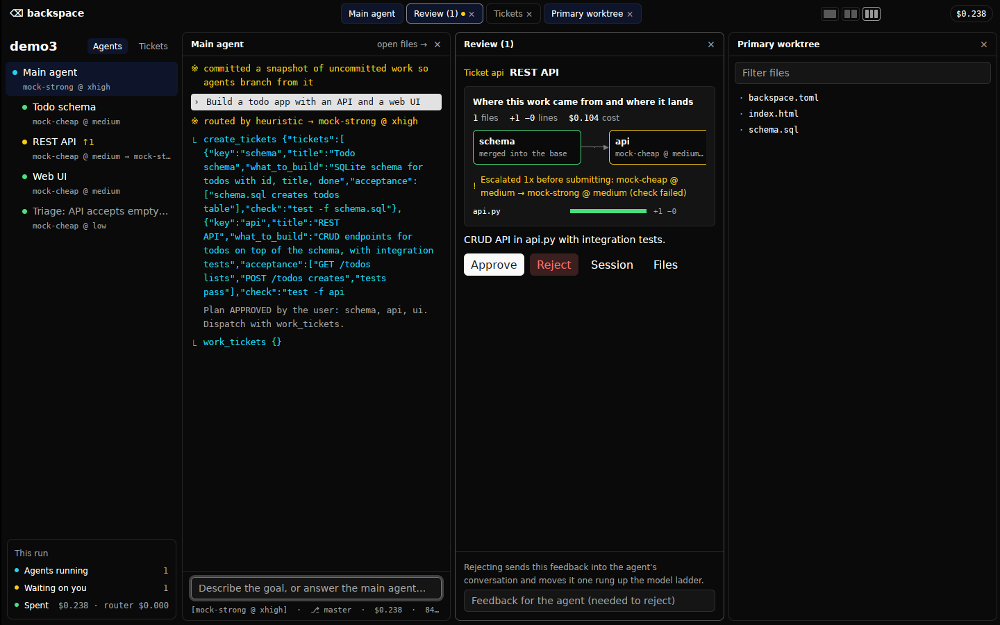

# backspace

A mixture-of-models agent harness with a GPUI desktop shell. You state a goal to
one **main agent**; it interviews you, turns the goal into tickets you approve,
and runs each ticket with its own agent on its own git branch. Work passes an
automatic check before it reaches you; you approve or reject with feedback, and
accepted work is merged.

Each agent is routed separately: [Jev](https://typesafe.ai) (TypeSafe's System One
decision model, ~$0.04/M tokens) picks **which model** and **what effort
level** (`low → medium → high → xhigh → max → ultra`) fit that agent's brief.
Without a Jev key a keyword heuristic stands in. Either way the pick is only a
starting point: agents start cheap and climb the ladder on evidence of failure.


**Design target:** [`design/workbench.html`](design/workbench.html) is a single-file, clickable replica of where the desktop app is heading: frosted macOS window, environment tabs (terminals up to 2x2, live worktree previews, diagram review, PLAN.md), resizable splits, light and dark.



**Architecture map:** open [`docs/architecture.html`](docs/architecture.html) in a browser for a zoomable map of the whole flow, with the code location of every step.

## Layout

```
crates/core   harness: router, providers, tools, tickets, git worktrees, skills
crates/cli    headless shell (logs to stdout, approvals on stdin)
crates/app    desktop shell, GPUI (native)
crates/tauri-app  desktop shell, Tauri 2 (the design's HTML in the system webview)
design/       workbench.html: the design both shells reproduce
bench/        GPUI vs Tauri benchmark (see bench/README.md)
```

## Desktop app

Two shells draw the same interface over the same in-process harness. Pick
one after reading the benchmark in `bench/README.md`:

- `backspace` (GPUI): native, starts about 5× faster and uses less memory.
  It has no web engine, so a browser canvas shows a text snapshot of the
  page and opens the page itself in your browser.
- `backspace-tauri` (Tauri 2): HTML/CSS/JS in the system webview, with live
  dev-server previews inside the app.

`design/workbench.html` is the original static mock; the shells have moved
past it (tabs of canvases, machines, settings).

- **Tabs** sit on the left of the title bar. Each holds one to four
  canvases (2×2 at four). `+` opens a new tab with a name and a layout;
  unnamed tabs show their layout icon. Right-click or double-click a tab to
  rename, duplicate or close it.
- **Canvases** show an agent session, a worktree, a browser, the diagram
  review or PLAN.md. The `+` on the right adds one; an empty canvas offers a
  picker. Drag the gaps to resize.
- **Tickets** open in a drawer from the review pill (top right): hover a
  moment, or click to pin. File tickets there, and open one for its details.
- **Machines** switch from the sidebar foot (laptop = this machine, cloud =
  a followed one; `+` adds one). The sidebar title shows which machine you
  are looking at.
- **Settings** (gear) cover the theme, machines, sharing this machine, and
  update checks. The update pill reads "Up to date" or "Download & Update".

Tabs, theme and machines live in `~/.config/backspace/prefs.json`, shared by
both shells (`BACKSPACE_PREFS` overrides the path).

### Following other machines

Run the harness headless on any machine and share it:

```sh
BACKSPACE_TOKEN=... backspace-cli serve ~/projects/my-app 127.0.0.1:7420
```

Then add it from Settings → Machines with its address and token. You see its
agents, tickets and reviews live, and can talk to its main agent and
approve or reject from your machine. A desktop shell can share its own
harness the same way (Settings → Share this machine). The API is plain HTTP
with a bearer token, so keep it on localhost behind an SSH tunnel
(`ssh -L 7420:127.0.0.1:7420 box`) or on a private network such as
Tailscale.

**Every review starts with a diagram the harness draws from its own data**,
never one the agent drew:

- *Plan*: the ticket graph in waves, how many run in parallel, which tickets
  have no check.
- *Ticket*: the blockers it built on, the model path (including escalations),
  the check that passed, where it merges, and exact per-file line counts.
- *Final*: every ticket with its state and route, plus anything left open.



## Principles (after Pi)

- **Four tools**: `read`, `write`, `edit`, `bash`. Everything else goes through bash.
- **Config is the product**: one TOML file, no hidden merging. Models, prices,
  descriptions (what Jev reads to choose), providers, caps. `backspace-cli init-config`
  writes the default to `./backspace.toml`.
- **`AGENTS.md`** in the workspace is appended to every agent's system prompt.
- Two wire formats cover most models: Anthropic Messages and OpenAI-compatible
  Chat Completions (OpenRouter, Ollama, vLLM, ...).

## Run

Needs Rust ≥ 1.98 (gpui-pre uses APIs that 1.94 rejects). On Linux:
`libxkbcommon-dev libxkbcommon-x11-dev libwayland-dev libvulkan-dev libfontconfig-dev`.

```sh
export ANTHROPIC_API_KEY=...     # and/or OPENROUTER_API_KEY
export TYPESAFE_API_KEY=...      # optional: Jev routing
cargo run --release -p backspace -- ~/projects/my-app     # GUI (GPUI)
cargo run --release -p backspace-tauri -- ~/projects/my-app   # GUI (Tauri; Linux needs libwebkit2gtk-4.1-dev)
cargo run --release -p backspace-cli -- ~/projects/my-app "build ..."
cargo run --release -p backspace-cli -- serve ~/projects/my-app     # share it
cargo test                                                 # core + e2e (mock model)
```

## How a project runs

1. **Grill.** Your first message is the goal. The main agent interviews you in
   rounds (mattpocock `grilling`): numbered questions, each with its recommended
   answer, so "go" accepts them all. Turn off with `workflow.grill = false`.
2. **Plan as tickets.** It writes `PLAN.md`, then `create_tickets` (mattpocock
   `to-tickets`): vertical slices with acceptance criteria, `blocked_by` edges
   and, ideally, a `check` command. **You approve the plan** before any work
   starts (`workflow.plan_approval`); a rejected plan is discarded and redone.
3. **Dispatch.** `work_tickets` starts one agent per ticket, in parallel,
   respecting `blocked_by`.
4. **Isolate.** Each ticket agent gets its own branch (`backspace/<key>`) and
   git worktree (`.backspace/worktrees/<key>`), forked from its parent's branch
   *after* its blockers were merged, so it builds on their work.
5. **Gate.** On `submit_deliverable` the harness commits the worktree and runs
   the ticket's `check`. A failing check bounces straight back to the agent;
   nobody reviews broken work.
6. **Review and merge.** You approve or reject (with feedback) each top-level
   ticket; the card shows the `git diff --stat`. Accepted work is merged into the
   parent's branch. A merge conflict is handed back to the agent with the exact
   `git merge` to run.
7. The main agent verifies the merged result and submits the final deliverable.

### Start cheap, escalate on evidence

The router's pick is a *prior*, capped at `escalation.start_max_effort` /
`start_max_tier` (default `medium`, tier 2). An agent moves one rung up (more
effort while below `high`, then the cheapest stronger model, then more effort)
only on evidence:

- its ticket's check failed,
- a reviewer rejected it or sent it back with `revise_ticket`,
- it made the same tool call `loop_repeats` times in a row,
- it exhausted its turn budget.

At most `max_steps` rungs. Every finished ticket appends its route, escalations,
cost and outcome to `.backspace/outcomes.jsonl`: the data to learn routing from
later, instead of guessing from briefs.

### Tickets and triage

Tickets live in state and are mirrored to `.backspace/tickets/NN-key.md`
(mattpocock's local-tracker format), states `proposed → ready-for-agent →
queued → in-progress → in-review → done`, plus `needs-triage`, `needs-info`,
`ready-for-human`, `failed`, `wontfix`.

Agents call `file_ticket` for anything outside their scope instead of fixing
it; you can file from the Tickets tab. A **triage agent** (read-only, forced to
`low` effort) verifies the claim, checks for duplicates and classifies it
(mattpocock `triage`). Ready ones show up in the owner's next `work_tickets`
report.

### Nested teams (after Paperclip)

- Agents above `max_depth` (default 2) can create and dispatch their own
  sub-tickets: main → leads → their reports. Sub-branches fork from and merge
  into the lead's branch.
- **Review follows the org chart.** Tickets at depth ≤ `human_review_depth`
  (default 1) come to you; deeper ones go to the agent that planned them, which
  verifies in its worktree and can reopen one with `revise_ticket`.
- **Goal ancestry.** Every brief carries the chain of goals up to the project goal.
- **Budgets.** `budget_usd` on a ticket caps that agent *and its subtree*;
  `max_project_usd` caps the project.

### Skills

Vendored from [mattpocock/skills](https://github.com/mattpocock/skills) (MIT,
commit in `crates/core/skills/UPSTREAM`): `grilling`, `to-tickets`, `triage`,
`tdd`, `diagnosing-bugs`, `code-review`. Each role gets some injected
(`workflow.*_skills`); every agent can load any of them with the `skill` tool.
Drop a folder with a `SKILL.md` into `~/.config/backspace/skills/` or
`<workspace>/.backspace/skills/` to override one or add your own. The files are
kept verbatim; a short adapter note maps their vocabulary (the Skill tool,
issue tracker, sub-agents) onto Backspace.

State is written to `<workspace>/.backspace/state.json` as a record of the run.
`.backspace/` ignores itself in git.

## Known limits

- No sandbox: `bash` runs as you, in the workspace. The file tools refuse paths
  outside it; bash does not. Run it in a container or VM for untrusted goals.
- Not resumable: closing the app ends in-flight agents. `state.json` is a log,
  not a checkpoint.
- Non-streaming requests; long single turns show up only when they finish.
- The workspace must be a git repo (one is created if not). Uncommitted work is
  committed as `backspace: snapshot before run` so agents can branch from it,
  and agents' work is merged onto the branch you have checked out. Use
  `isolation = "shared"` to skip git entirely.
- Worktrees are kept after the run (for reopening tickets); each has its own
  copy of dependencies (`node_modules`, `target/`), which costs disk.
- Merge conflicts are handed back to the agent, but that path is only covered
  by the git unit test, not the end-to-end tests.
- The heuristic router is crude by design; routing quality comes from Jev.
