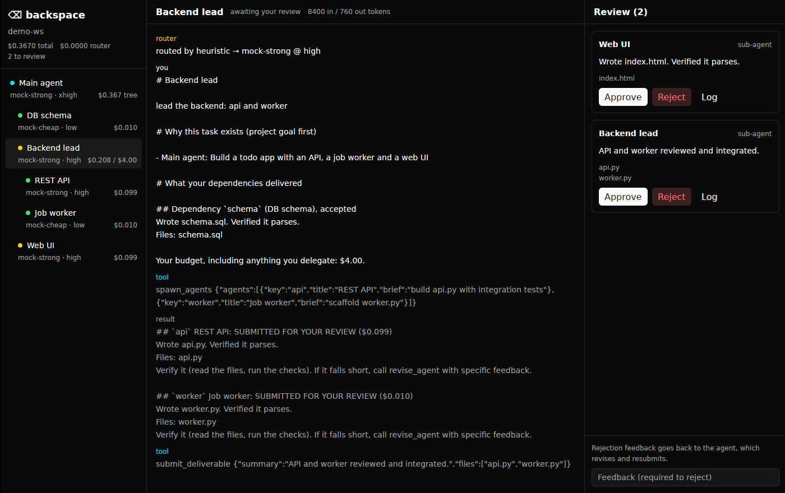

# backspace

A mixture-of-models agent harness with a GPUI desktop shell. You state a goal to
one **main agent** inside a project; it plans, spawns as many **sub-agents** as
the work parallelizes into, and every deliverable (each sub-agent's, then the
final one) lands in a review queue for you to approve or reject with feedback.

Each agent is routed separately: [Jev](https://typesafe.ai) (TypeSafe's System One
decision model, ~$0.04/M tokens) picks **which model** and **what effort
level** (`low → medium → high → xhigh → max → ultra`) fit that agent's brief.
Without a Jev key a keyword heuristic stands in.



## Layout

```
crates/core   harness: router (Jev + heuristic), providers, tools, orchestration
crates/cli    headless shell (logs to stdout, approvals on stdin)
crates/app    GPUI desktop app (gpui-kit / gpui-component)
```

## Principles (after Pi)

- **Four tools**: `read`, `write`, `edit`, `bash`. Everything else goes through bash.
- **Config is the product**: one TOML file, no hidden merging. Models, prices,
  descriptions (what Jev reads to choose), providers, caps. `backspace-cli init-config`
  writes the default to `./backspace.toml`.
- **`AGENTS.md`** in the workspace is appended to every agent's system prompt.
- Two wire formats cover most models: Anthropic Messages and OpenAI-compatible
  Chat Completions (OpenRouter, Ollama, vLLM, ...).

## Run

Needs Rust ≥ 1.98 (gpui-pre uses APIs that 1.94 rejects). On Linux:
`libxkbcommon-dev libxkbcommon-x11-dev libwayland-dev libvulkan-dev libfontconfig-dev`.

```sh
export ANTHROPIC_API_KEY=...     # and/or OPENROUTER_API_KEY
export TYPESAFE_API_KEY=...      # optional: Jev routing
cargo run --release -p backspace -- ~/projects/my-app     # GUI
cargo run --release -p backspace-cli -- ~/projects/my-app "build ..."
cargo test                                                 # core + e2e (mock model)
```

## How a project runs

1. Your first message is the goal. The main agent is routed (floor: `high` effort).
2. It writes `PLAN.md`, then calls `spawn_agents` with self-contained briefs and
   `depends_on` edges. Each sub-agent is routed on its own brief.
3. Sub-agents run concurrently (`max_parallel_calls` in-flight requests), each
   waiting for its dependencies' **approved** deliverables, which are injected
   into its prompt.
4. `submit_deliverable` blocks the agent until you decide. Rejection feedback goes
   back into that agent's conversation; it revises and resubmits.
5. The main agent integrates, verifies, and submits the final deliverable.

### Nested teams (after Paperclip)

- Any agent above `max_depth` (default 2) gets `spawn_agents` and `revise_agent`:
  main → leads → their reports.
- **Review follows the org chart.** Deliverables from depth ≤ `human_review_depth`
  (default 1) come to you; deeper ones go to the agent that spawned them, which
  must verify and can reopen a report with `revise_agent`. You review leads,
  not every leaf.
- **Goal ancestry.** Every brief carries the chain of goals above it, up to the
  project goal.
- **Budgets.** `budget_usd` on a spawn caps that agent *and its whole subtree*;
  `max_project_usd` caps the project. When a cap is hit the agent is told to
  wrap up, then stopped two turns later.
- Dependencies are sibling-only, which keeps the wait graph acyclic.

State is written to `<workspace>/.backspace/state.json` as a record of the run.

## Known limits

- No sandbox: `bash` runs as you, in the workspace. The file tools refuse paths
  outside it; bash does not. Run it in a container or VM for untrusted goals.
- Not resumable: closing the app ends in-flight agents. `state.json` is a log,
  not a checkpoint.
- Non-streaming requests; long single turns show up only when they finish.
- The heuristic router is crude by design; routing quality comes from Jev.
